# SmartSwipe


library|smart-swipe|smart-swipe-support|smart-swipe-x
:---:|:---:|:---:|:---:
latest version| [](https://bintray.com/hellobilly/android/smart-swipe/_latestVersion)| [](https://bintray.com/hellobilly/android/smart-swipe-x/_latestVersion)| [](https://bintray.com/hellobilly/android/smart-swipe-support/_latestVersion)


[中文文档，更详尽](https://luckybilly.github.io/SmartSwipe-tutorial/)

A smart swipe android library helps you make View (and Activity) swipes easier.

In addition, to facilitate the use, `SmartSwipe` encapsulates the following tool classes:

- [SmartSwipeBack][SmartSwipeBack]: <br/>All Activities slide back in an easy way via a single line code. <br/>without any super activity class; without translucent theme; without any code into BaseActivity; without any code into xml layout files;
- [SmartSwipeRefresh][SmartSwipeRefresh]: <br/>With a single line code to achieve swipe refresh and load more. Compatible with vertical and horizontal
- [SwipeConsumerExclusiveGroup][SwipeConsumerExclusiveGroup]: <br/>Manages a set of exclusive `SwipeConsumer`s, can only open one at a time.


## Demo

[download demo.apk](https://github.com/luckybilly/SmartSwipe/raw/master/app-release.apk)

Stretch<br/>[StretchConsumer][StretchConsumer]|Space<br/>[SpaceConsumer][SpaceConsumer]|Translucent Sliding<br/>[TranslucentSlidingConsumer][TranslucentSlidingConsumer]
:---:|:---:|:---:
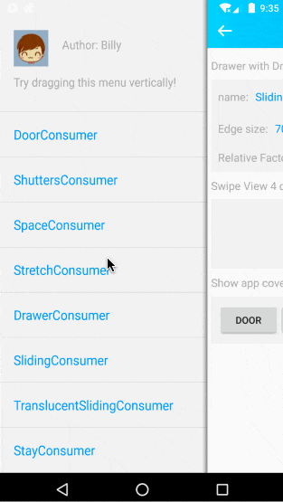|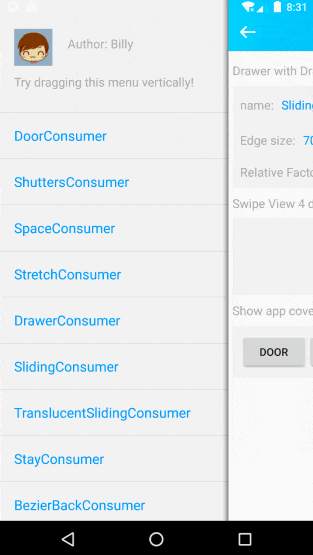|
Drawer above<br/>[DrawerConsumer][DrawerConsumer]|Drawer behind<br/>(factor is settable)<br/>[SlidingConsumer][SlidingConsumer]|
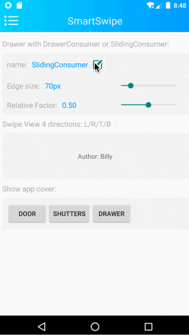|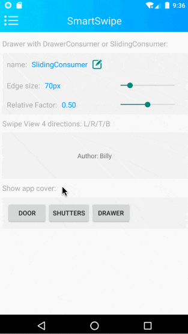|
Doors Open<br/>[DoorConsumer][DoorConsumer]|Shutters Open<br/>[ShuttersConsumer][ShuttersConsumer]|
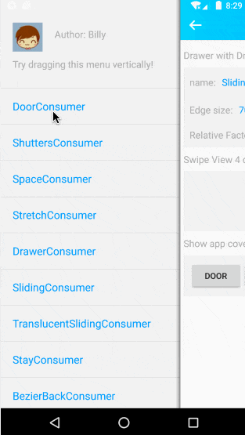|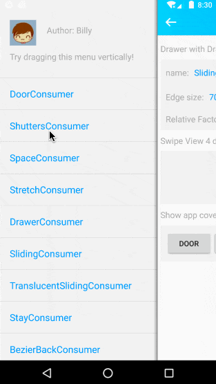|

#### Create a cover

Doors open|Shutters Open|Drawer Open
:---:|:---:|:---:
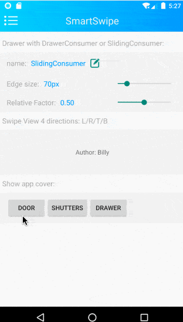|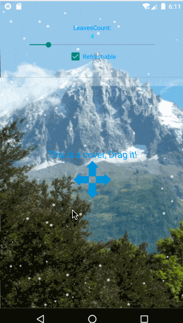|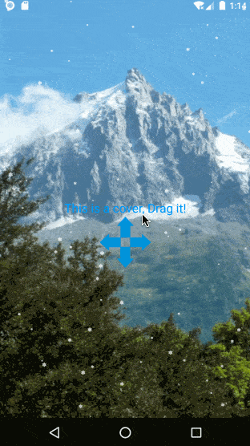


#### Activity sliding back

All Activities slide back in an easy way via a single line code. 

- without any super activity class;
- without translucent theme; 
- without any code into BaseActivity; 
- without any code into xml layout files;

Back via release velocity<br/>[StayConsumer][StayConsumer]|Translucent Sliding Back<br/>[ActivitySlidingBackConsumer][ActivitySlidingBackConsumer]|Back with bezier<br/>[BezierBackConsumer][BezierBackConsumer]
:---:|:---:|:---:
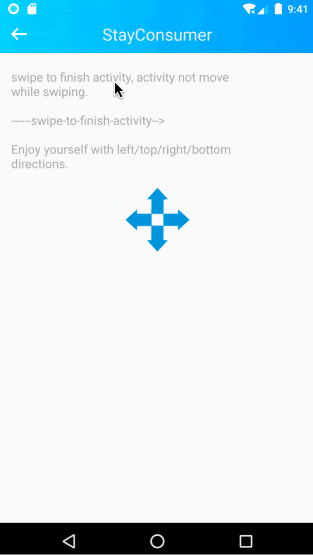||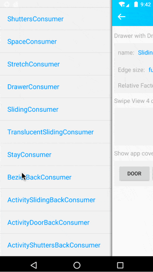
Like doors open<br/>[ActivityDoorBackConsumer][ActivityDoorBackConsumer]|Like shutters open<br/>[ActivityShuttersBackConsumer][ActivityShuttersBackConsumer]|<font color="blue">Global Usage</font><br/>[SmartSwipeBack][SmartSwipeBack]
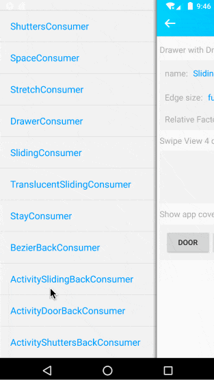|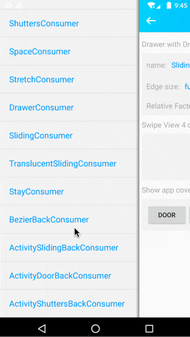|


## Usage

First add `SmartSwipe` to your project

```groovy
implementation 'com.billy.android:smart-swipe:latestVersion'
```

Nested scrolling only compatible after android api above 21(android 5.0) with core library(smart-swipe)

Add extension library to compat for android support library or androidX like below:

```groovy
implementation 'com.billy.android:smart-swipe:latestVersion'
//compat for android support library
implementation 'com.billy.android:smart-swipe-support:latestVersion'
```

or

```groovy
implementation 'com.billy.android:smart-swipe:latestVersion'
//compat for android x
implementation 'com.billy.android:smart-swipe-x:latestVersion'
```

`SmartSwipe` can be used by chain programming within a single line code. The usage of API looks like follow:

```java
SmartSwipe.wrap(...) 		//view or Activity
	.addConsumer(...) 		//add a SwipeConsumer
	.enableDirection(...) 	//Specifies which side of the slide the SwipeConsumer will consumes
	.setXxx(...) 			//[optional] some other Settings
	.addListener(...); 		//[optional] add listener(s) to the SwipeConsumer
```
#### Sample code：

```java
//	When view cannot scroll vertically (or scrolling to the top/bottom), 
//	if continue to drag, the UI will show elastic stretching effect, 
//	and smooth recovery after release
SmartSwipe.wrap(view)
	.addConsumer(new StretchConsumer())
	.enableVertical();
```

#### Add more than one 'SwipeConsumer' to the same View. Such as:

```java
SmartSwipe.wrap(view)
	.addConsumer(new StretchConsumer())
	.enableVertical() 					//Stretch effect at directions: top and bottom
	.addConsumer(new SpaceConsumer())
	.enableHorizontal() 				//Space effect at directions: left and right
	;
```

[Click here][SwipeConsumer] for more details about `SwipeConsumers`

#### Activity slides back with a single line of code globally

```java
SmartSwipeBack.activityBezierBack(application, null);	//bezier shows while swiping
SmartSwipeBack.activityStayBack(application, null);		//Back via release velocity
SmartSwipeBack.activitySlidingBack(application, null);	//sliding with pre-activity relative moves
SmartSwipeBack.activityDoorBack(application, null);		//finish activity like doors open
SmartSwipeBack.activityShuttersBack(application, null);	//finish activity like shutters open
```
[Click here][SmartSwipeBack] For more Details

### Add swipe refresh to a View via a single line code

```java
//the second parameter within xxxMode:
// false: works vertically(swipe down to refresh and swipe up to load more)
// true: works horizontally(swipe right to refresh and swipe right to load more) 
SmartSwipeRefresh.drawerMode(view, false).setDataLoader(loader);
SmartSwipeRefresh.behindMode(view, false).setDataLoader(loader);
SmartSwipeRefresh.scaleMode(view, false).setDataLoader(loader);
SmartSwipeRefresh.translateMode(view, false).setDataLoader(loader);
```

You can use default headers and footers, and you can also customize your own. 

The refresh extension library(`smart-swipe-refresh-ext`: [](https://bintray.com/hellobilly/android/smart-swipe-refresh-ext/_latestVersion)) will include some fancy third-party headers and footers.

here is the first one(Based on [Ifxcyr/ArrowDrawable](https://github.com/Ifxcyr/ArrowDrawable)):

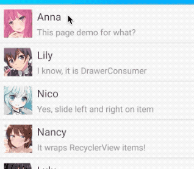

[Click here][SmartSwipeRefresh] For more Details

## `SmartSwipe` features：

- support for 4 directions swipe( left/top/right/bottom)
- supports adding multiple `SwipeConsumer`s to the same View(/Activity)
- supports nested usage
- support to use for list items in ListView and RecyclerView and the list itself
- compat for NestedScroll (android support library and androidX)
- A dozen of built-in `SwipeConsumer`s effects


## Thanks

- [Simon-Leeeeeeeee/SLWidget](https://github.com/Simon-Leeeeeeeee/SLWidget/blob/master/swipeback/src/main/java/cn/simonlee/widget/swipeback/SwipeBackHelper.java)
- [ikew0ng/SwipeBackLayout](https://github.com/ikew0ng/SwipeBackLayout)
- [Blankj/SwipePanel](https://github.com/Blankj/SwipePanel)
- [qinci/AndroidSlideBack](https://github.com/qinci/AndroidSlideBack)
- [scwang90/SmartRefreshLayout](https://github.com/scwang90/SmartRefreshLayout)
- https://www.thiswaifudoesnotexist.net/
- https://www.iconfont.cn/
- https://m.sc.enterdesk.com/sucai/477026.html
- [AnliaLee/FallingView](https://github.com/AnliaLee/FallingView)
- [jd-alexander/LikeButton](https://github.com/jd-alexander/LikeButton)
- [Ifxcyr/ArrowDrawable](https://github.com/Ifxcyr/ArrowDrawable)


[ViewDragHelper]: https://android.googlesource.com/platform/frameworks/support/+/refs/heads/androidx-master-dev/customview/src/main/java/androidx/customview/widget/ViewDragHelper.java
[SwipeConsumer]: https://luckybilly.github.io/SmartSwipe-tutorial/pages/SwipeConsumer.html
[SmartSwipeBack]: https://luckybilly.github.io/SmartSwipe-tutorial/pages/SmartSwipeBack.html
[SmartSwipeRefresh]: https://luckybilly.github.io/SmartSwipe-tutorial/pages/SmartSwipeRefresh.html
[SwipeConsumerExclusiveGroup]: https://luckybilly.github.io/SmartSwipe-tutorial/pages/SwipeConsumerExclusiveGroup.html

[ActivityDoorBackConsumer]: https://luckybilly.github.io/SmartSwipe-tutorial/pages/consumers/ActivityDoorBackConsumer.html
[ActivityShuttersBackConsumer]: https://luckybilly.github.io/SmartSwipe-tutorial/pages/consumers/ActivityShuttersBackConsumer.html
[ActivitySlidingBackConsumer]: https://luckybilly.github.io/SmartSwipe-tutorial/pages/consumers/ActivitySlidingBackConsumer.html
[BezierBackConsumer]: https://luckybilly.github.io/SmartSwipe-tutorial/pages/consumers/BezierBackConsumer.html
[DoorConsumer]: https://luckybilly.github.io/SmartSwipe-tutorial/pages/consumers/DoorConsumer.html
[DrawerConsumer]: https://luckybilly.github.io/SmartSwipe-tutorial/pages/consumers/DrawerConsumer.html
[ShuttersConsumer]: https://luckybilly.github.io/SmartSwipe-tutorial/pages/consumers/ShuttersConsumer.html
[SlidingConsumer]: https://luckybilly.github.io/SmartSwipe-tutorial/pages/consumers/SlidingConsumer.html
[SpaceConsumer]: https://luckybilly.github.io/SmartSwipe-tutorial/pages/consumers/SpaceConsumer.html
[StayConsumer]: https://luckybilly.github.io/SmartSwipe-tutorial/pages/consumers/StayConsumer.html
[StretchConsumer]: https://luckybilly.github.io/SmartSwipe-tutorial/pages/consumers/StretchConsumer.html
[TranslucentSlidingConsumer]: https://luckybilly.github.io/SmartSwipe-tutorial/pages/consumers/TranslucentSlidingConsumer.html
